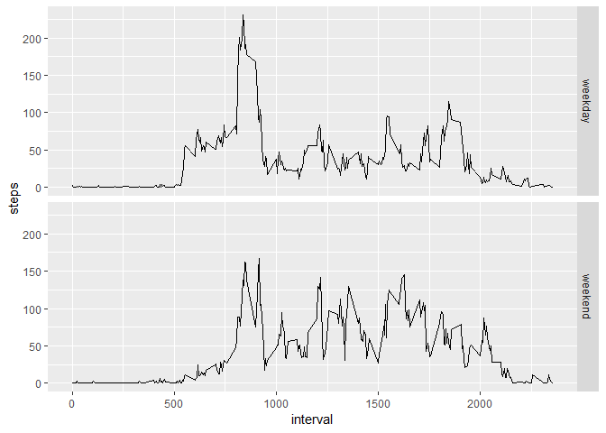

## Loading and preprocessing the data
1. Load the data (i.e.read.csv())
2. Process/transform the data (if necessary) into a format suitable for your analysis

```r
library(tidyverse)

# 1.
unzip("activity.zip")
activity <- read_csv("activity.zip")
```


## What is mean total number of steps taken per day?
1. Calculate the total number of steps taken per day
2. If you do not understand the difference between a histogram and a barplot, research the difference between them. Make a histogram of the total number of steps taken each day
3. Calculate and report the mean and median of the total number of steps taken per day

```r
#1. 
steps_per_day <- activity %>%
  na.omit() %>% 
  group_by(date) %>% 
  summarize(steps = sum(steps))
#2.  
ggplot(steps_per_day, aes(x = steps))+
  geom_histogram()
```

<!-- -->

```r
#3.
ignored_mean <- mean(steps_per_day$steps)
ignored_median <- median(steps_per_day$steps)
```

The mean and median number steps per day are **10766.1886792453** and **10765**, respectively.


## What is the average daily activity pattern?
1. Make a time series plot (i.e. type = "l") of the 5-minute interval (x-axis) and the average number of steps taken, averaged across all days (y-axis)
2. Which 5-minute interval, on average across all the days in the dataset, contains the maximum number of steps?

```r
#1. 
average_daily_activity <- activity %>% 
  na.omit() %>% 
  group_by(interval) %>% 
  summarize(steps = mean(steps))

ggplot(average_daily_activity, aes(x = interval, y = steps)) +
  geom_point()
```

<!-- -->

```r
#2. 
busiest_interval <- average_daily_activity %>% 
  filter(steps == max(steps)) %>% 
  .$interval
```
The busiest time interval (maximum number of steps) is **835**.


## Imputing missing values
1. Calculate and report the total number of missing values in the dataset (i.e. the total number of rows with NAs)
2. Devise a strategy for filling in all of the missing values in the dataset. The strategy does not need to be sophisticated. For example, you could use the mean/median for that day, or the mean for that 5-minute interval, etc.
3. Create a new dataset that is equal to the original dataset but with the missing data filled in.
4. Make a histogram of the total number of steps taken each day and Calculate and report the mean and median total number of steps taken per day. Do these values differ from the estimates from the first part of the assignment? What is the impact of imputing missing data on the estimates of the total daily number of steps?

```r
#1.
n_missing_values <- sum(is.na(activity))

imputed_activity <- activity
 
#2. Replace NAs with the average daily number of steps for that time interval
#3. 
for (i in 1:nrow(activity)){
   if (is.na(activity$steps[i])){
     imputed_activity$steps[i]=unlist(average_daily_activity[average_daily_activity$interval==activity$interval[[i]],"steps"])
   }
 }

#4.
steps_per_day_complete <- imputed_activity %>% 
  group_by(date) %>% 
  summarize(steps = sum(steps))
  
ggplot(steps_per_day_complete, aes(steps))+
  geom_histogram()
```

```
## `stat_bin()` using `bins = 30`. Pick better value with `binwidth`.
```

<!-- -->

```r
imputed_mean <- mean(steps_per_day_complete$steps)
imputed_median <- median(steps_per_day_complete$steps)
```
The total number of missing values is **2304**.

Because there are no days with no data available at all, we cannot replace their missing values with the daily average. We instead replace those intervals with missing values with the mean step count for that 5-minute interval, previously calculated.

When we impute the mean number of steps in a given 5-minute interval for missing values, the mean and median number of steps per day were found to be **10766.1886792453** and **10766.1886792453**, respectively. These statistics differ from the those of the non-imputed data set by **0** and **1.1886792452824**, which represents a negligible impact. It is not suprising that there is no change in the calculated mean, since missing values were imputed with mean values. Because the median increases when the missing values are imputed with the mean, we can infer that the original distribution was slightly skewed towards higher values.

## Are there differences in activity patterns between weekdays and weekends?
1. Create a new factor variable in the dataset with two levels - "weekday" and "weekend" indicating whether a given date is a weekday or weekend day.
2. Make a panel plot containing a time series plot (i.e. type = "l") of the 5-minute interval (x-axis) and the average number of steps taken, averaged across all weekday days or weekend days (y-axis). See the README file in the GitHub repository to see an example of what this plot should look like using simulated data.

```r
#1.
Week <- imputed_activity %>% 
  mutate(day = as.factor(ifelse(weekdays(date) %in% c("Saturday", "Sunday"),"weekend", "weekday")))
#2.
PLOTS <- Week %>% 
  group_by(day, interval) %>% 
  summarize(steps = mean(steps)) %>% 
  ggplot(aes(x = interval, y = steps))+
  geom_line() +
  facet_grid(day ~ .)

PLOTS
```

<!-- -->

There are subtle but notable differences between the average activity patterns of a weekends vs. weekedays. Both show an initial peak of activity in the morning hours, but starts much earlier for weekdays (as early as 5:30). On average, activity is shifted to alter in the day on weekends, which can be illustrated by adding a trendline to the plots.

```r
PLOTS + geom_smooth()
```

<!-- -->

